# 
 **Optimizers for Deep Learning**

#### 
Group Member：Andrew Zeng</pr>
---
# Content
## 1. Notations and Introduction to Problems
## 2. The Most Common Optimizers 
## 3. Improving for Existing Optimizers
## 4. Reference

---
# **Part 1** 
# 
**Notations and Introduction to Problems**

---

## 1.1 Some Notations

$\eta:$ learning rate

$\theta^{t}:$ model parameters at time step t

$L(\theta^{t})$: loss function at $\theta^{t}$

$m^{t+1}:$ momentum accumulated from time step 0 to time step t, which is used to compute $\theta^{t+1}$

$\nabla L(\theta^{t}) \ or \ g^{t}:$ gradient at $\theta^{t}$, used to compute $\theta^{t+1}$

---

## 1.2 Introduction to Problems
We always want to find a $\theta$ to get the lowest $\Sigma_{x}L(\theta;x)$ or to get the lowest $L(\theta)$.
$$
\theta^{*}=arg\ min_{\theta}L(\theta)
$$

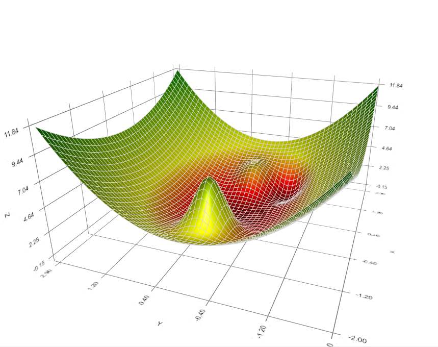

---

# **Part 2**
# 
**The Most Common Optimizers** 

---

## 2.1 Gradient Descent
**The steps of Gradient Descent：**
1. Start at position $\theta^{0}$ randomly.
2. Compute gradient $\nabla L(\theta^{0})$
3. Move to $\theta^{1} \leftarrow \ \theta^{0}-\eta\nabla L(\theta^{0})$
4. $\cdots \cdots$
5. Compute gradient $\nabla L(\theta^{t})$
6. Move to $\theta^{t+1} \leftarrow \ \theta^{t}-\eta\nabla L(\theta^{t})$
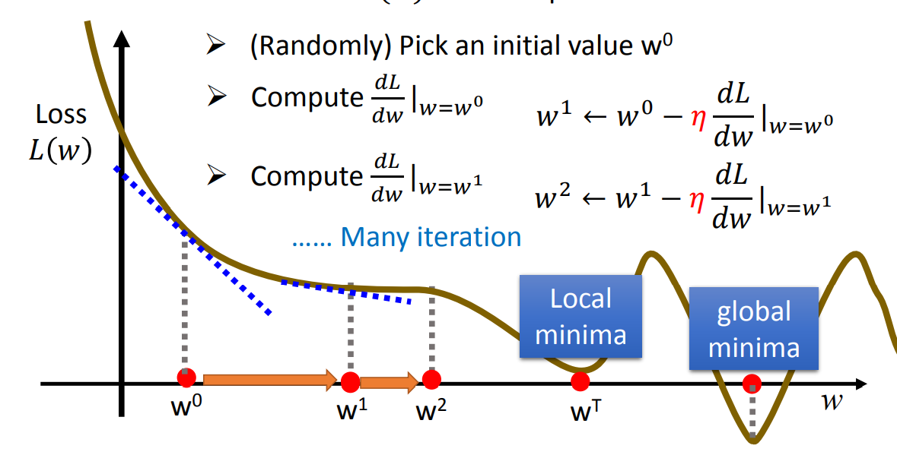

---

## 2.1 Gradient Descent
**Gradient Descent has some problems?**
1. How to choose learning rate $\eta$. Is it appropriate to keep $\eta$ fixed?
2. How to slove the problem of local optimal?
3. How to improve the iteraiton speed?
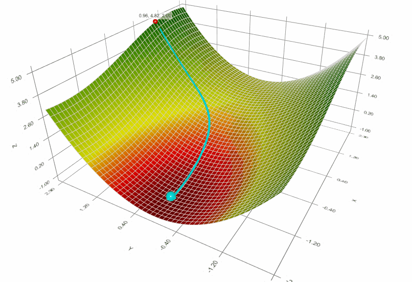   

---

## 2.2 Stochastic Gradient Descent(SGD)
Let's first consider solving the problem of iteration speed mentioned above
**The steps of SGD:**
1. Start at position $\theta^{0}$ randomly.
2. Compute gradient $\nabla L(\theta^{0})$（considering one example at a time）
1. move to $\theta^{1} \leftarrow \ \theta^{0}-\eta\nabla L(\theta^{0})$
2. $\cdots \cdots$
3. Compute gradient $\nabla L(\theta^{t})$（above）
4. Move to $\theta^{t+1} \leftarrow \ \theta^{t}-\eta\nabla L(\theta^{t})$
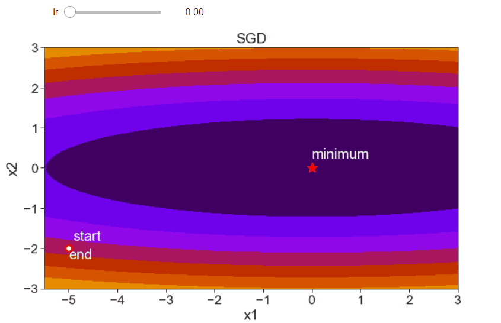   

---

## 2.2 Stochastic Gradient Descent(SGD)
### The comparsion between GD and SGD:
**Gradient Descent:** Updata after seeing all examples

**SGD:** Updata for each example If there are 20 examples, 20 times faster.
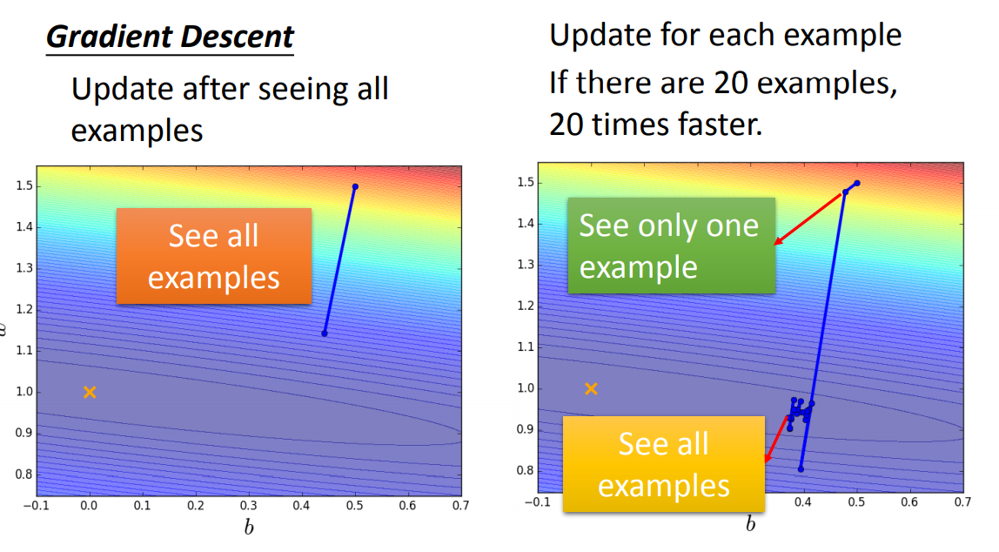  

---

## 2.3 SGD with Momentum(SGDM)
**Introducing Movement: Movement of last step minus gradient at present**
**SGDM:**
1. Start at position $\theta^{0}$ randomly, $Movement \ v^{0}=0$
2. Compute Gradient $\nabla L(\theta^{0})$ （considering one example at a time）
3. $Movement\ v^{1}=\lambda v^{0}-\eta \nabla L(\theta^{0})$
4. Move to $\theta^{1}=\theta^{0}+v^{1}$
5. $\cdots \cdots$
6. Compute Gradient $\nabla L(\theta^{t})$（above）
7. $Movement\ v^{t+1}=\lambda v^{t}-\eta \nabla L(\theta^{t})$
8. Move to $\theta^{t+1}=\theta^{t}+v^{t+1}$
   
---

## 2.3 SGD with Momentum(SGDM)
**Why use Momentum?**
$v^{i}$not just based on gradient，but previous $movement$, $v^{i}$ is actually the weighted sum of all the previous gradient:$\nabla L(\theta^{0}),\nabla L(\theta^{1}),\cdots,\nabla L(\theta^{i-1})$, 
**That is :**
$v^{i}=-\lambda^{i-1}\eta \nabla L(\theta^{0})-\lambda^{i-2}\eta\nabla L(\theta^{1})\cdots-\eta\nabla L(\theta^{i-1})$
Momentum can be analogous to **inertia** in a process of motion, in the case of a graph like the one on the right, where after a local optimum is reached, due to **inertia**, the search continues until it is globally optimal.
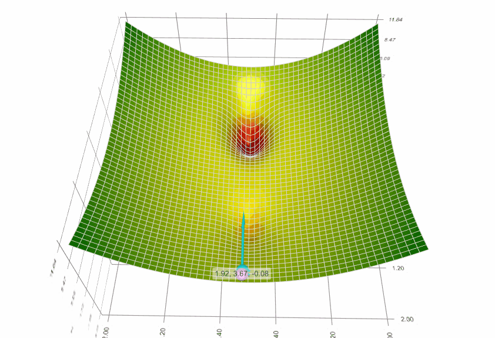  

---

In the two methods mentioned above, we have actually solved two of the three problems mentioned earlier: the speed of iteration and local optimization.But the problem of **learning rate** has not been solved:
When $\eta$ is too large, We can find that the iterative process cannot converge. When $\eta$ is too small, the iterative process is too slow. 
**The ideas to solve this problem：**
1. Reduce the learning rate by some factors every few epoches.
At the begining, we are far from the destination, so we use larger learning rate. After several epochs, we are close the destination, so we reduce the learning rate
2. Giving different parameters different learning rates.
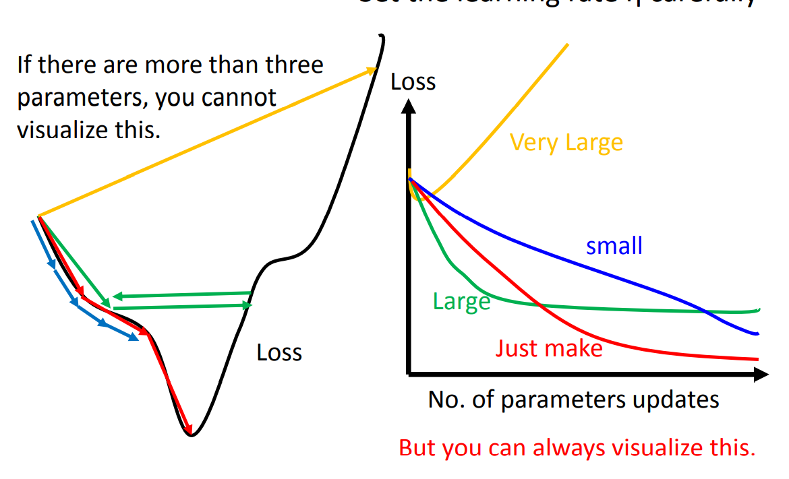
---

## 2.4 Adagrad
**Divide the learning rate of each parameter by the root mean square of its previous derivatives**
**The step of Adagrad：**
1. Start at position $\theta^{0}$ randomly.
2. Compute gradient $\nabla L(\theta^{0})$ 
3. Move to $\theta^{1}=\theta^{0}-\frac{\eta^{0}}{\sigma^{0}}\nabla L(\theta^{0}), \eta^{0}=\frac{\eta}{\sqrt{1}}, \sigma^{0}=\sqrt{(\nabla L(\theta^{0}))^{2}}$
4. $\cdots \cdots$
5. Compute gradient $\nabla L(\theta^{t})$
6. Move to $\theta^{t+1}=\theta^{t}-\frac{\eta^{t}}{\sigma^{t}}\nabla L(\theta^{t}), \eta^{t}=\frac{\eta}{\sqrt{t+1}}, \sigma^{t}=\sqrt{\frac{1}{t+1}\Sigma_{i=0}^{t}(\nabla L(\theta^{i}))^{2}}$
---
**We can conlude that**
$\theta^{t+1}=\theta^{t}-\frac{\eta}{\sqrt{\Sigma_{i=0}^{t}(\nabla L(\theta^{i}))^{2})}}$
**As the GIF show:**
Because of Adagrad，When the point on a more rugged route(the gradient is large), we choose a smaller learning rate. When the point on a more rugged route, we choose a large learning rate. 
**A Problem:**
What if the gradients at the first few time steps are extremely large? Will it cause Adagrad stopping at the begining?
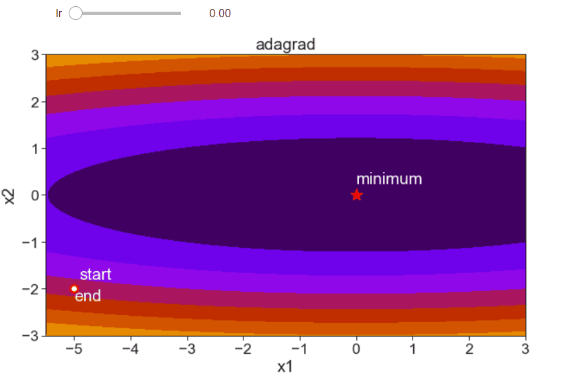

---

## 2.5 RMSProp
**Like the previous set of momentum, and Let the previous gradient lower the weight. So the gradient exponential average sum is no longer linearly increasing.**
**The step of RMSProp：**
1. Start at position $\theta^{0}$ randomly.
2. Compute Gradient $\nabla L(\theta^{0})$ 
3. Move to $\theta^{1}=\theta^{0}-\frac{\eta}{\sqrt{v_{1}}}\nabla L(\theta^{0}), v^{1}=(\nabla L(\theta^{0}))^{2}$
4. $\cdots \cdots$
5. Compute Gradient $\nabla L(\theta^{t})$
6. Move to $\theta^{t}=\theta^{t-1}-\frac{\eta}{\sqrt{v^{t}}}\nabla L(\theta^{t-1}), v^{t}=\alpha v^{t-1}+(1-\alpha)(g^{t-1})^{2}$

---

## 2.7 Adam
RMSProp solves the problem of learning rate，but has not solved the problem of local optimal；But we solve the problem of optimal earlier. Why not combine SGDM with RMSProp?
**RMSProp**
$$
\theta^{t}=\theta^{t-1}-\frac{\eta}{\sqrt{v^{t}}}\nabla L(\theta^{t-1}) \\
v^{1}=\nabla L(\theta^{0})^{2}\\
v^{t}=\beta_{2}v^{t-1}+(1-\beta_{2})(\nabla L(\theta^{t}))^{2}
$$
$+$

---
**SGDM**
$$
\theta^{t}=\theta^{t-1}-\eta m^{t} \\
m^{t}=\beta_{1}m^{t-1}+(1-\beta_{1})\nabla L(\theta^{t-1})
$$
**We can conclude the expression of Adam:**
$$
\theta^{t}=\theta^{t-1}-\frac{\eta}{\sqrt{\hat{v}^{t}}+\epsilon}\hat{m}^{t} \\
\hat{m}^{t}=\frac{m^{t}}{1-\beta_{1}^{t}} ,
\hat{v}^{t}=\frac{v^{t}}{1-\beta_{2}^{t}} \\
\beta_{1}=0.9 ,
\beta_{2}=0.999 \\
\epsilon = 10^{-8}
$$
**$1-\beta_{1}^{t},1-\beta^{t}_{2}$:**
To prevent the problem that we will meet when $m^{t}, v^{t}$ is too large at the begining, which causes $\hat{m^{t}}, \hat{v^{t} }$ changes a lot with the step of training.

---

## 2.7 Adam vs SGDM
**Compare the Adam and SGDM on training set:**

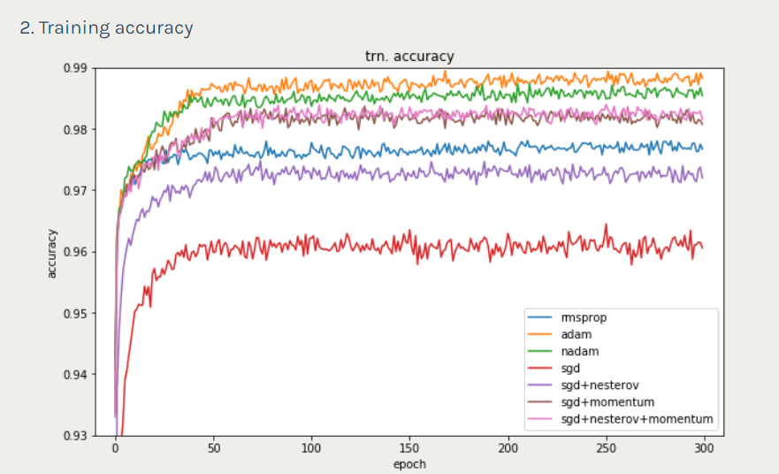

We can find that Adam is fast to train in this experiment.

[实验链接](https://shaoanlu.wordpress.com/2017/05/29/sgd-all-which-one-is-the-best-optimizer-dogs-vs-cats-toy-experiment/)

---

## 2.7 Adam vs SGDM
**Compare the Adam and SGDM on training set:**
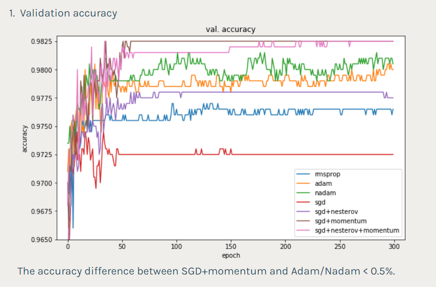

We can find that SGDM has better generalization in this experiment.

[实验链接](https://shaoanlu.wordpress.com/2017/05/29/sgd-all-which-one-is-the-best-optimizer-dogs-vs-cats-toy-experiment/)

---

## 2.7 Adam vs SGDM
**Compare the convergence between Adam and SGDM：**
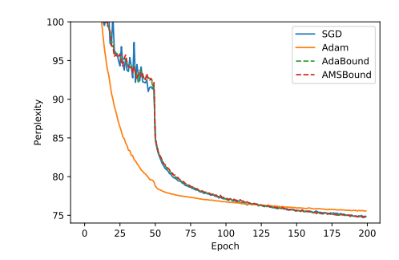

We can find that Adam has better convergence in this experiment.

[论文地址](https://arxiv.org/abs/1902.09843)
**Conclusion：**
Adam : fast training, unstable

SGDM: stable, better generalization, better convergence

---
# **Part 3**
# **
Improving for Existing Optimizers
**

Adam was proposed in 2014，it has become the most common optimizer with SGDM，Can we improve them?

---

## 3.1 Combine Adam with SGDM？

**SWATS:**
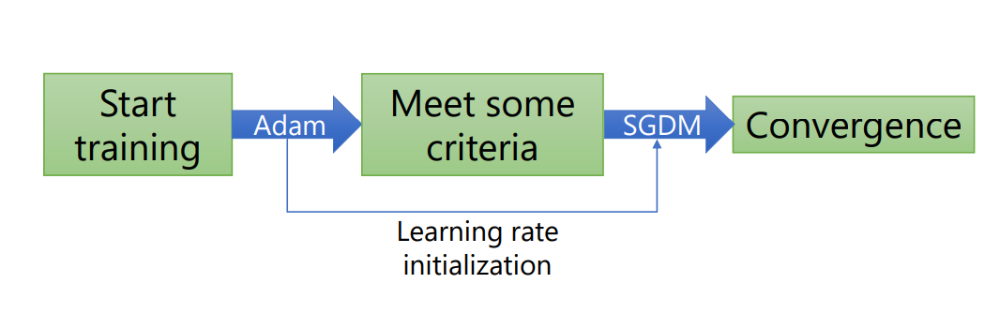

论文网址：https://openreview.net/forum?id=rk6qdGgCZ&noteId=rk6qdGgCZ

---

## 3.2 The disadvantage of Adam？
In some extreme situations：
| step     | $\cdots$ | 100000 | 100001 | 100002 | 100003 | $\cdots$ | 100999            | 101000          | $\cdots$ |
| -------- | -------- | ------ | ------ | ------ | ------ | -------- | ----------------- | --------------- | -------- |
| gradient |          | 1      | 1      | 1      | 1      |          | 100000            | 1               |          |
| movement |          | $\eta$ | $\eta$ | $\eta$ | $\eta$ |          | $10\sqrt{10}\eta$ | $10^{-3.5}\eta$ |          |
Consider this situation: If gradients are too small before, we can not find good directions at the first 100998 steps. We meet useful directions suddenly at 100999 step. But due to the accumulation of useless gradients. The movement is only $10\sqrt{10}\eta$, but the useless movement is too large, how to fix it?

**Somebody propose AMSGrad**[Reddi, et al., ICLR'18]

---

## 3.3 OR will help!
After the proposal of each algorithm, there are both advantages and disadvantages in its use. Only the algorithm that can solve the real problem is a good algorithm, that is our **OR** to solve the problem.
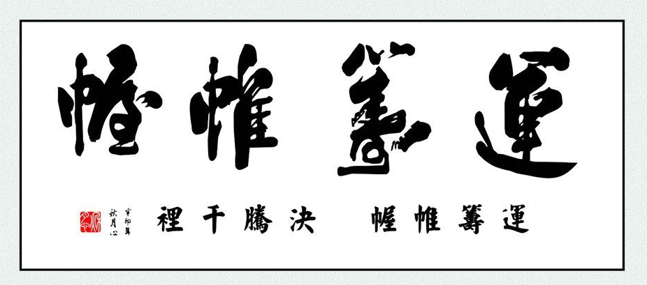

---
# **Part 4**
# **
Reference**

---
• [Hung-yi Lee, et al., Lecture slides] “ML 2020”，Lecture slides, 2020
• [Ruder, arXiv’17] Sebastian Ruder, “An Overview of Gradient
Descent Optimization Algorithms”, arXiv, 2017
• [Hinton, et al., Lecture slides, 2013] Geoffrey Hinton, Nitish
Srivastava and Kevin Swersky, ”RMSProp”, Lecture slides, 2013
• [Rumelhart, et al., Nature’86] David E. Rumelhart, Geoffrey E.
Hinton and Ronald J. Williams, “Learning Representations by BackPropagating Errors”, Nature, 1986
•[Kingma, et al., ICLR’15] Diederik P. Kingma and Jimmy Ba, “A
Method for Stochastic Optimization”, ICLR, 2015

